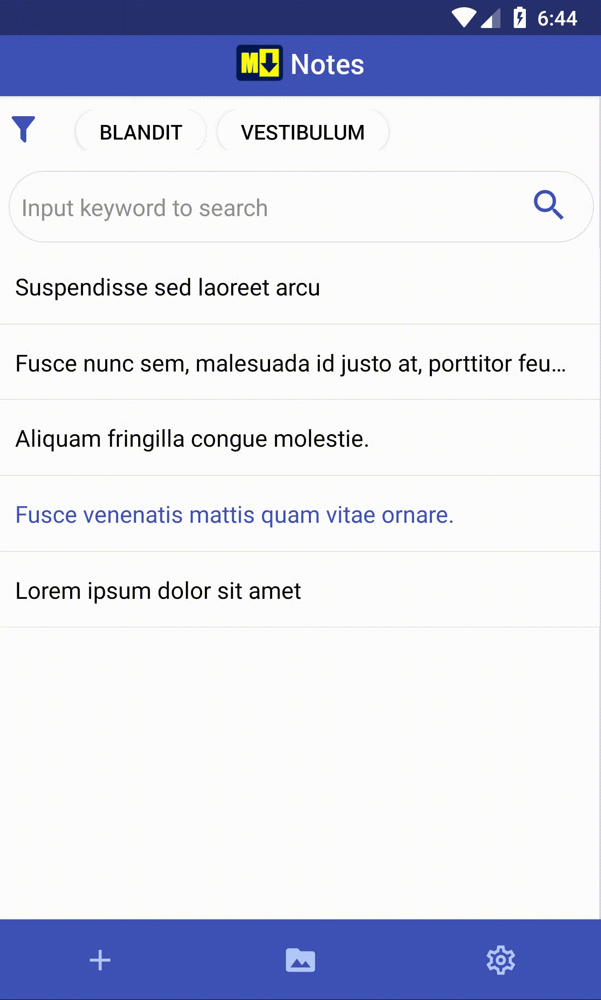
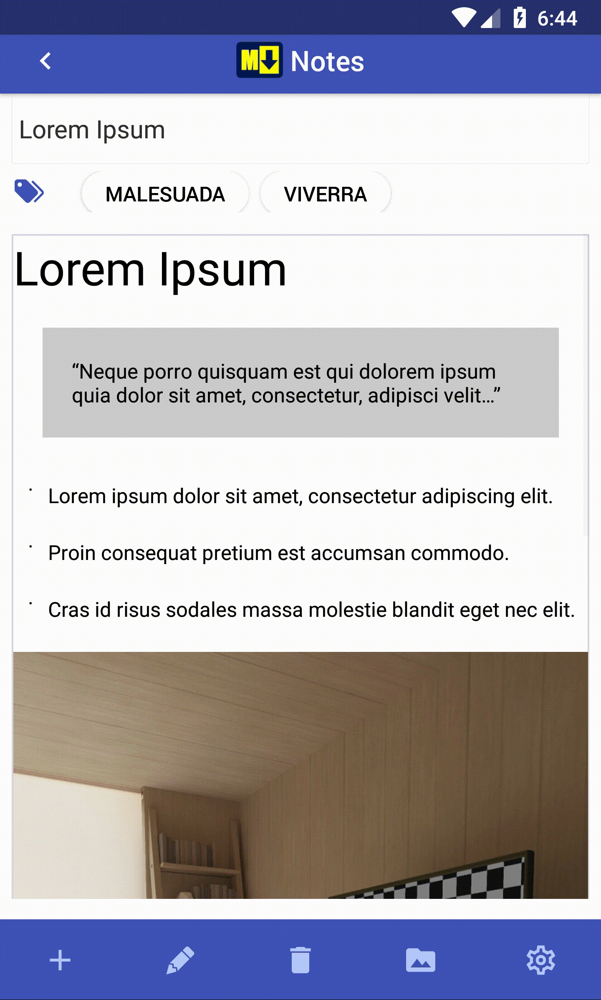
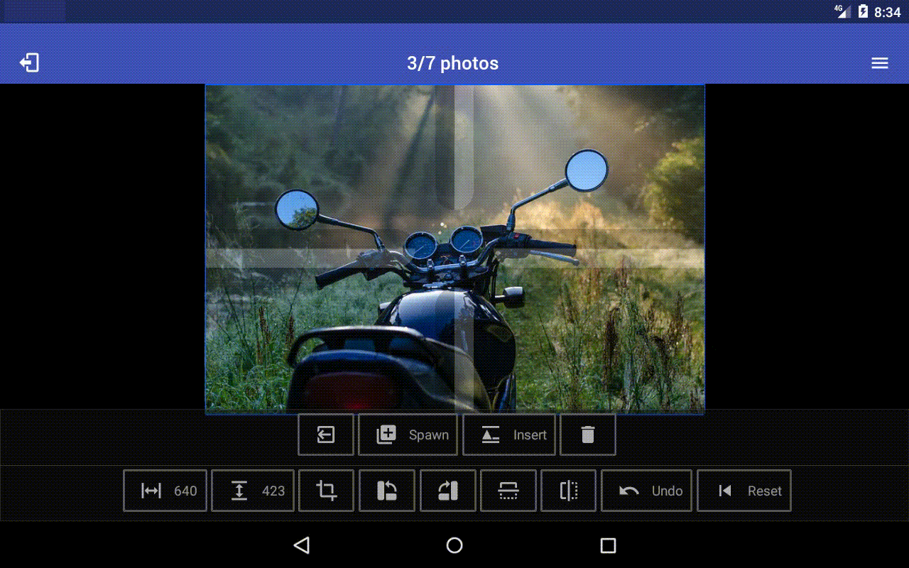

# Emarks

This is a simple note app that supports CommonMark - canonical Markdown.
With markdown notes, you can create formated notes from simple text.

## Features

- Support iOS and Android
- Support phone and tablet
- Support CommonMark - canonical markdown specification.
- Markdown syntax buttons
- Support tags
- Support contents search
- Embed image library.
- Import images from the photo library and camera.

## Remarks

As an example of using the [react-native-image-kit](https://github.com/rheesh/react-native-image-kit),
this source was opened. 
If you find the react-native-image-kit useful, [please purchase this app.](https://play.google.com/store/apps/details?id=com.snac.mdnote)
(App Name : Emarks, Price : 0.99$)

Or please support me with [a glass of beer :beer:](https://www.paypal.me/SeunghoYi).  

## Screen Shot

  

  

 

 

 

